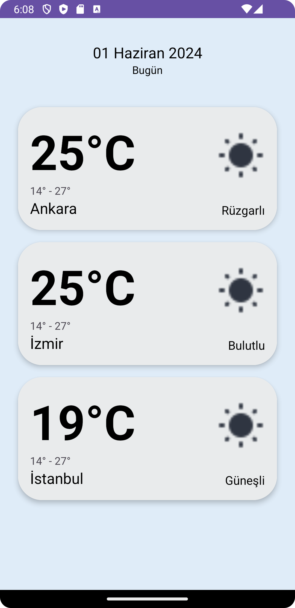

Bu hafta, repomda iki task üzerinde çalıştım. İlk task sadece UI tasarımı üzerineydi. İkinci task ise fragmentlar ve aktiviteler arasında veri iletimi ve ekran geçişleri üzerineydi. Bu taskta farklı yöntemler ile veri paslama ve ekran geçişlerinin sorunsuz bir şekilde çalışması içinbir çalışmada bulundum.
Projelerimi bir araya getirerek, bu iki taski tek bir uygulama altında birleştirdim. Ardından, bu çalışmayı repoma ekleyerek, aldığım geri bildirimlere göre düzenlemelere başlamış bulunmaktayım şu an.

